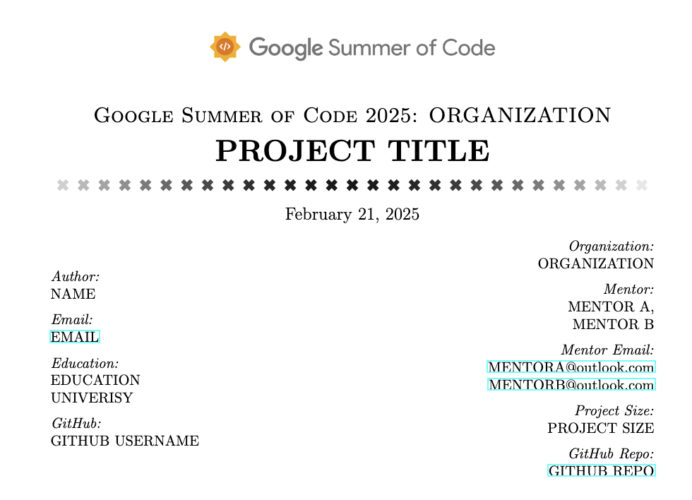
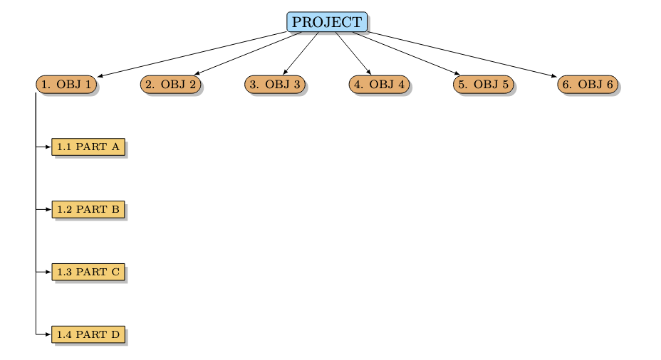

# GSoC_latex_template
A custom Latex template for the Google Summer of Code, based on the template originally from University of Amsterdam [UvA Informatica Template Artikel by Robert van Wijk](https://www.overleaf.com/latex/templates/uva-informatica-template-artikel/dsjkstcpphny)

## Title Page
Suitable Title page to include all the personal, organization, mentor, and project information.

## Work Breakdown Structure Graph
Updated work breakdown structure graph based on the work of [Gonzalo Medina](https://tex.stackexchange.com/questions/81809/work-breakdown-structure-wbs-tikz)

## Proposal Requirement
Listed requirements for the proposal based on the webpage of [Writing a proposal by GSoC Guide](https://google.github.io/gsocguides/student/writing-a-proposal) and [Proposal Template by NumFOCUS](https://github.com/numfocus/gsoc/blob/master/templates/proposal.md)
